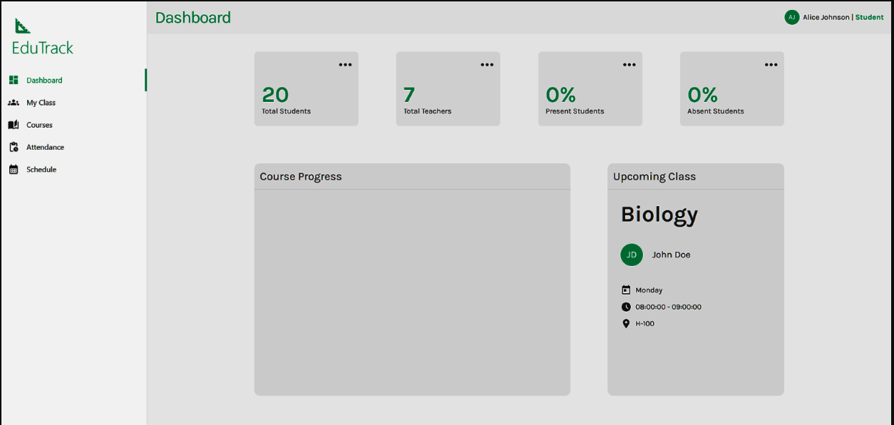
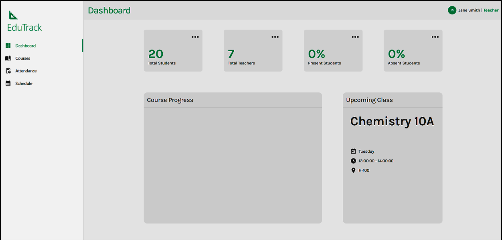
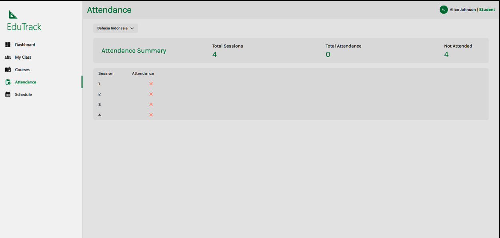
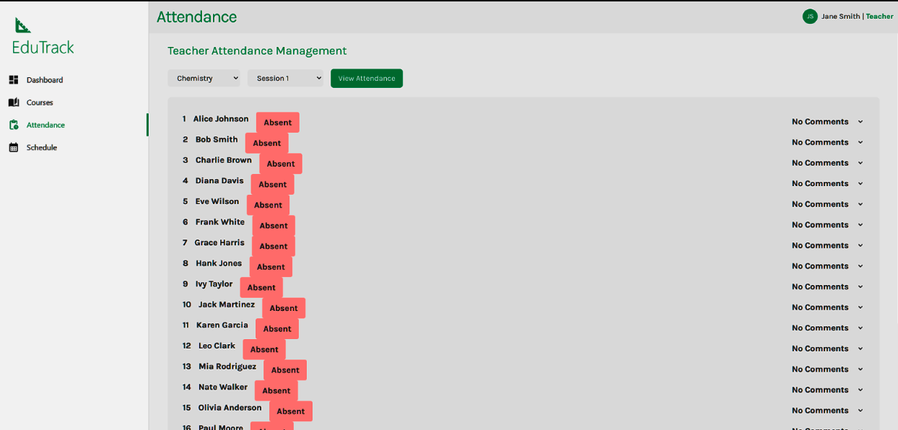
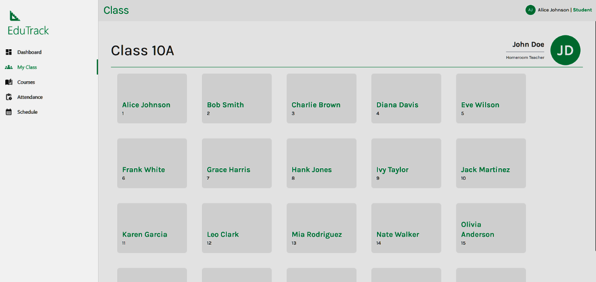
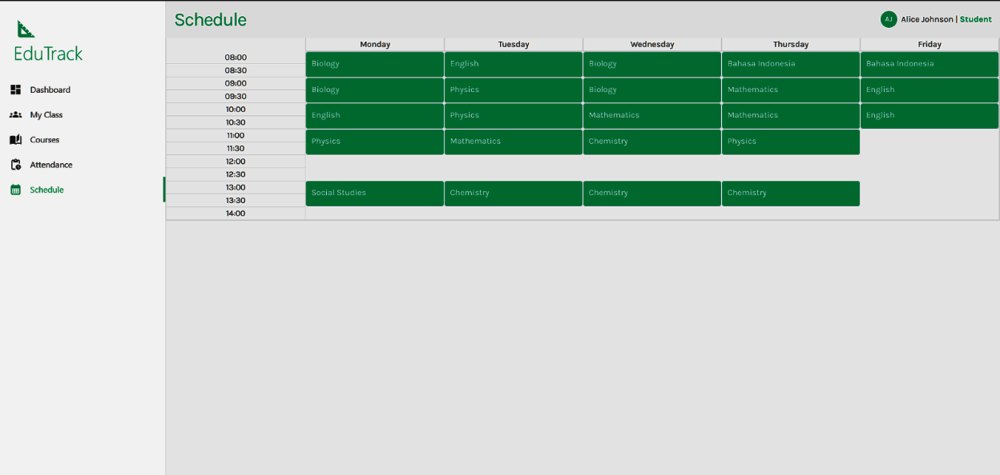
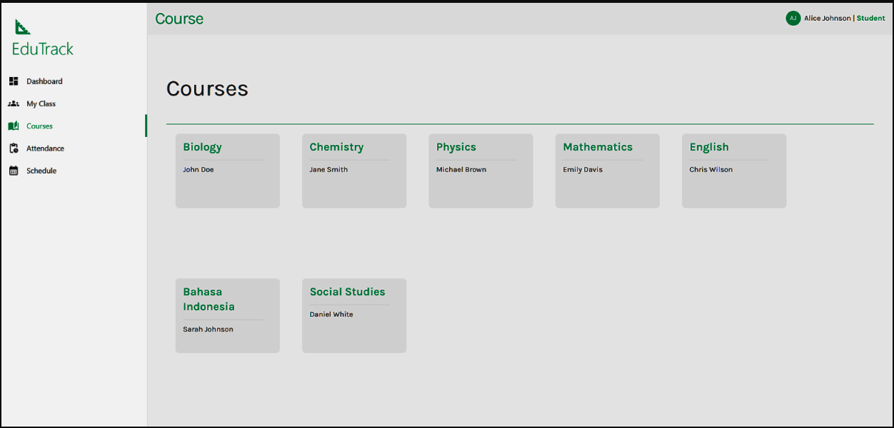

# EduTrack

## Project Overview

#### Project Name: EduTrack - School Management System

Team Members:
1. Matthew Staniswinata
2. Adrian Nugroho Basuki
3. Justin Hadinata

Class: L3AC

Semester: Fall 2024

Course: COMP6799001 - Database Technology

----

EduTrack is designed to streamline and simplified administrative tasks in an educational setting.  This application will allow for efficient tracking of student progress, automated reporting, and secure access control for administrators, teachers, and students. It offers separate interfaces for students and teachers, enabling access to relevant data and functionalities based on their respective roles.

This project is a React-based education tracking application. It utilizes a backend (Node.js with Express) to handle database interactions and provides a user-friendly interface for managing student data, courses, attendance, and grades.


## Technologies Used

* **Frontend:** React, MUI (Material-UI), Tailwind CSS, Axios for API requests
* **Backend:** Node.js, Express.js, MySQL for database interactions, Express-session for user sessions.

## Features

**Student Features:**

* **View Classmates:** See a list of other students enrolled in the same class.
* **View Enrolled Courses:**  Access details about their registered courses.
* **Check Attendance:** Monitor their attendance status for each course session (Present/Absent).
* **View Teacher Information:** Access limited teacher information (name).
* **View Classroom Information:** See the classroom location.
* **Weekly Schedule:** View a timetable of their classes.

**Teacher Features:**

* **View Student List:**  Access the roster of students in their classes.
* **Post and Update Student Grades:**  Record and modify student grades (Not yet implemented).
* **Manage Course Details:** Basic course details accessible, more features planned.
* **Record and Update Attendance:** Mark student attendance for each session.
* **View Classroom Information:** Access classroom details.
* **Weekly Schedule:**  View a timetable of their teaching schedule.

## File Project Structure
```
├─ .gitattributes
├─ .gitignore
├─ README.md
├─ backend
│  ├─ .gitignore
│  ├─ attendance.js
│  ├─ class.js
│  ├─ connection.js
│  ├─ course.js
│  ├─ dashboard.js
│  ├─ index.js
│  ├─ login copy.js
│  ├─ login.js
│  ├─ package-lock.json
│  ├─ package.json
│  └─ schedule.js
├─ client
│  ├─ .gitignore
│  ├─ README.md
│  ├─ package-lock.json
│  ├─ package.json
│  ├─ public
│  │  ├─ favicon.ico
│  │  ├─ index.html
│  │  ├─ logo192.png
│  │  ├─ logo512.png
│  │  ├─ manifest.json
│  │  └─ robots.txt
│  ├─ src
│  │  ├─ App.js
│  │  ├─ component
│  │  │  ├─ CourseCard.jsx
│  │  │  ├─ Error.jsx
│  │  │  ├─ Header.jsx
│  │  │  ├─ LoginForm.jsx
│  │  │  ├─ MainTitle.jsx
│  │  │  ├─ RightLeftContainer.jsx
│  │  │  ├─ SessionDetail.jsx
│  │  │  ├─ SessionList.jsx
│  │  │  ├─ SideItem.jsx
│  │  │  ├─ Sidebar.jsx
│  │  │  ├─ StudentCard.jsx
│  │  │  └─ TotalCard.jsx
│  │  ├─ contexts
│  │  │  ├─ AttendanceContext.jsx
│  │  │  └─ SchoolContext.jsx
│  │  ├─ index.css
│  │  ├─ index.js
│  │  ├─ pages
│  │  │  ├─ Add.jsx
│  │  │  ├─ Attendance.jsx
│  │  │  ├─ AttendanceContainer copy.jsx
│  │  │  ├─ AttendanceContainer.jsx
│  │  │  ├─ Books.jsx
│  │  │  ├─ ClassContainer.jsx
│  │  │  ├─ CourseContainer.jsx
│  │  │  ├─ Dropdown copy.jsx
│  │  │  ├─ Dropdown.jsx
│  │  │  ├─ HomePage.jsx
│  │  │  ├─ HomeScreen.jsx
│  │  │  ├─ ScheduleContainer.jsx
│  │  │  ├─ TeacherAttendanceContainer copy.jsx
│  │  │  ├─ TeacherAttendanceContainer.jsx
│  │  │  ├─ TeacherAttendanceView.jsx
│  │  │  ├─ TeacherDropdown.jsx
│  │  │  ├─ Update.jsx
│  │  │  └─ login.jsx
│  │  └─ style.css
│  └─ tailwind.config.js
├─ package-lock.json
└─ package.json
```

## Setup Instructions
1. **Clone the repository:**
   ```bash
   git clone https://github.com/JustinHadiwijata/CS-Database_EduTrack.git 
   ```
2. **Navigate to project directory:**
   ```bash
   cd CS-Database_EduTrack
   ```
3. **Install dependencies:**
   ```bash
   npm install
   ```
4. **Set up MySQL database:** 

Ensure your MySQL Server database is appropriately configured with database, username, credentials.  See the project report and associated `SQL Code` snippets regarding tables creation.

5.  **Start the development server**:
    ```bash
    npm start
    ```

This will start the development server for the frontend at `http://localhost:3000`.  The frontend will communicate with the backend on `http://localhost:8800`.

## UI Design(Screenshot of the Project)


Student Dashboard:

* **Total Students/Teachers:**  Overview of student and teacher counts.
* **Attendance Summary:** Current attendance statistics (present/absent percentages).
* **Course Progress:** (Not yet implemented)  Area for future course progress tracking.
* **Upcoming Class:** Details about the next scheduled class, including course name, teacher, time, and classroom.


Teacher Dashboard

The dashboard is similar with the student dashboard. But with additional features/information relevant to the teacher. Currently it displays the same information as the student dashboard.


Student Attendance:

The student attendance page provides an overview of their attendance for a selected course and specific session

* **Attendance Summary:** Total sessions, total attended, and total missed.
* **Session List:** A table listing each session with the student's attendance status (X for absent)


Teacher Attendance

The teacher attendance page allows teachers to manage attendance for their classes:

* **Course/Session Selection:**  Dropdowns to select the course and session.
* **Attendance Grid:** A list of students with their attendance status (present/absent) and an option to add comments. (Note: The dropdown under "No Comments" implies some form of data entry or feedback option).


The student class page displays:

* **Class Name:** The name of the class.
* **Homeroom Teacher:** The name and initials of the homeroom teacher.
* **Classmate List:**  A grid of classmates with their names and ID numbers


Student Schedule:

The Student Schedule allows students to view: 
* **5-days week schedule:** Schedule for 5-days and time between 08.00 to 14.00.
* **Sessions:** All sessions that students must attend in order


Student Courses:
* **Course Name:** The course/subject name
* **Course Instructor:** The course/subject instructor

## Project Status

This project represents a successful implementation of a database solution, for School Management System. The project seems to have met all initial requirements.

## Long-term Vision

1. Develop full-featured educational management platform
2. Fill in all other necessary features and/or other features that would be helpful for both students and teachers

## Links

Link for the github project: [Github Link](https://github.com/JustinHadinataCS/Database_EduTrack)

Link for the design creation of ERD: [LucidChart Link](https://lucid.app/lucidchart/c7c7e69b-2d4c-446e-aa8f-b5b3f2cbe568/edit?viewport_loc=4376%2C-3046%2C4561%2C1896%2C0_0&invitationId=inv_f8b21041-0a66-466f-89ed-26131771633f)